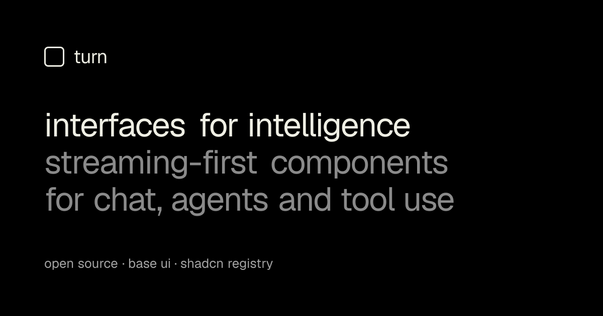

<p align="center">
  
</p>

# turn

Minimal, accessible React components for AI applications: chat, agents and tool use. Built on [Base UI](https://base-ui.com) and Tailwind CSS v4, and distributed through a [shadcn](https://ui.shadcn.com)-compatible registry, so you copy the source into your project and own every line.

**[turnui.xyz](https://turnui.xyz)** · [Getting started](https://turnui.xyz/docs/getting-started) · [Components](https://turnui.xyz/docs/button) · [Use with the AI SDK](https://turnui.xyz/docs/ai-sdk)

## Quick start

In a project that already uses Tailwind v4 and the shadcn CLI (`npx shadcn@latest init`):

```bash
npx shadcn@latest add https://turnui.xyz/r/theme.json
npx shadcn@latest add https://turnui.xyz/r/message.json https://turnui.xyz/r/prompt-composer.json
```

Each command also installs the components it depends on. Then follow [Getting started](https://turnui.xyz/docs/getting-started) for a working chat page.

## What is in it

21 components, built for streaming and for agents:

- **Conversation:** Message, Streaming Markdown, Code Block, Citations, Feedback, Scroll to Bottom, Thinking, Error Notice, Copy Button
- **Input:** Prompt Composer (attachments, drag and drop, paste), Slash Commands, Model Picker, Attachment, Suggestions
- **Agent:** Reasoning, Tool Call, Plan, Trace, Approval Prompt, Artifact
- **Foundation:** Button, plus hooks for auto-scroll, attachments and fake streams

Every component is keyboard operable, announces state to screen readers, and respects `prefers-reduced-motion`. See the [accessibility notes](https://turnui.xyz/docs/accessibility).

## Try it

[`templates/chat`](templates/chat) is a runnable chat app with streaming, reasoning, tool calls, errors with retry, and stop. It works with no API key (a built-in fake model) and switches to a real model when you set `AI_GATEWAY_API_KEY`.

```bash
pnpm install
pnpm --filter turn-chat-template dev
```

## Develop

This repo is a pnpm and Turborepo workspace.

- `apps/docs`: the docs site, live demos, and the component source (`src/registry`)
- `templates/chat`: the chat template

```bash
pnpm install
pnpm --filter docs dev    # docs site at http://localhost:3000
pnpm lint
pnpm test
pnpm build
```

Tests use Vitest and Testing Library, and every component runs through axe. jsdom cannot compute layout or color, so `color-contrast` is disabled there; contrast is checked in a real browser. A test fails the build if any animation lacks a reduced-motion opt-out.

See [CONTRIBUTING.md](CONTRIBUTING.md) to add a component, and [CHANGELOG.md](CHANGELOG.md) for what changed.

## Deploy

The docs site also serves the registry at `/r/*.json`. `pnpm build` generates the registry (`apps/docs/scripts/build-registry.mjs`) and then builds the site.

Registry items refer to each other by absolute URL, so the build needs to know the public origin. It defaults to `https://turnui.xyz` for production builds and `http://localhost:3000` for `pnpm dev`. To use another domain, set `NEXT_PUBLIC_REGISTRY_URL` before building (see `apps/docs/.env.example`).

## License

[MIT](LICENSE)
